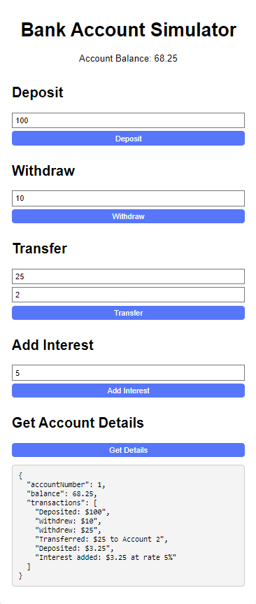

# Bank Account Project

## Overview
This project simulates a simple banking system using JavaScript. It includes functionalities to deposit, withdraw, transfer funds, add interest, and retrieve account details. The user interface is built with HTML and CSS.

## Project Structure

### Files
- **index.html**: The main HTML file that structures the web page.
- **styles.css**: The CSS file that styles the web page.
- **script.js**: The JavaScript file containing the BankAccount class and functions to handle banking operations.

## Detailed Functionality

### Main Functions in `script.js`

#### 1. `deposit(amount)`
- **Purpose**: Adds a specified amount to the account balance and records the transaction.
- **Usage**: `account1.deposit(100);`
- **Parameters**: 
  - `amount` (number): The amount to be deposited.
- **Description**: The function increases the account balance by the specified amount and logs the transaction as "Deposited: $amount".

#### 2. `withdraw(amount)`
- **Purpose**: Subtracts a specified amount from the account balance if sufficient funds are available and records the transaction.
- **Usage**: `account1.withdraw(50);`
- **Parameters**: 
  - `amount` (number): The amount to be withdrawn.
- **Description**: The function decreases the account balance by the specified amount if there are sufficient funds. If not, it alerts "Insufficient funds!". The transaction is logged as "Withdrew: $amount".

#### 3. `transfer(amount, toAccount)`
- **Purpose**: Transfers a specified amount to another account and records both the withdrawal and deposit transactions.
- **Usage**: `account1.transfer(50, account2);`
- **Parameters**: 
  - `amount` (number): The amount to be transferred.
  - `toAccount` (BankAccount): The account to transfer the funds to.
- **Description**: The function withdraws the specified amount from the current account and deposits it into the specified account. Both accounts log the transaction as "Transferred: $amount to Account toAccountNumber" and "Received: $amount from Account accountNumber" respectively.

#### 4. `addInterest(rate)`
- **Purpose**: Calculates and adds interest to the account balance based on a specified rate.
- **Usage**: `account1.addInterest(5);`
- **Parameters**: 
  - `rate` (number): The interest rate as a percentage.
- **Description**: The function calculates the interest based on the current balance and the specified rate, then deposits the interest into the account. The transaction is logged as "Interest added: $interest at rate rate%".

#### 5. `getDetails()`
- **Purpose**: Retrieves the account details, including the transaction history.
- **Usage**: `account1.getDetails();`
- **Returns**: 
  - An object containing the account number, current balance, and transaction history.
- **Description**: The function returns an object with the account number, balance, and an array of transactions.

### UI Functions in `script.js`

- **deposit()**: Handles the deposit operation from the UI.
- **withdraw()**: Handles the withdrawal operation from the UI.
- **transfer()**: Handles the transfer operation from the UI.
- **addInterest()**: Handles adding interest from the UI.
- **getAccountDetails()**: Displays the account details on the UI.
- **updateUI()**: Updates the UI with the current account balance.

## How to Run

1. Clone the repository:
   ```bash
   git clone https://github.com/piyushmali/BankAccountProject.git
   ```

2. Open the `index.html` file in your web browser.

3. Use the interface to perform banking operations:
   - **Deposit**: Enter an amount and click "Deposit".
   - **Withdraw**: Enter an amount and click "Withdraw".
   - **Transfer**: Enter an amount and the recipient account number (use 2 for the example account) and click "Transfer".
   - **Add Interest**: Enter an interest rate and click "Add Interest".
   - **Get Account Details**: Click "Get Details" to see the account balance and transaction history.

## Screenshots

### Deposit Action:
   

### Withdraw Action:
   

### Transfer Action:
   

### Add Interest Action:
   

### Account Details Action:
   


## Conclusion
This project demonstrates a simple banking system with essential functionalities. It allows users to interact with the system via a web interface, providing a practical example of how JavaScript can be used to manage financial transactions.
